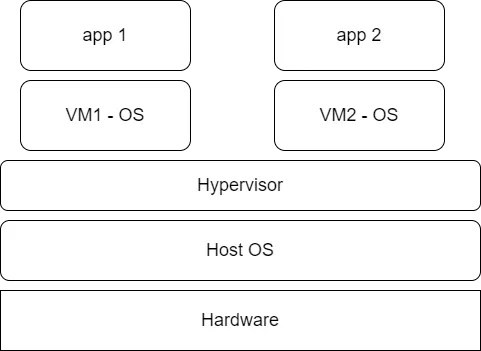
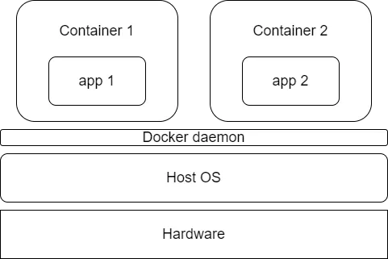

## Containers

Containers provide a way of creating an isolated environment, sometimes called a sandbox, in which applications and their dependencies can live.

## Why containers are useful
1. Portability '~~but it worked in my machine~~'
2. Consistency
3. Speed to deploy

## Virtual Machine (VMware)  VS Containers
Virtual machine
1. Hardware is virtualised and split up with a piece representing underlying pyhsical hardware
2. Hypervisor : software that virtualises hosts hardware and acts as a broker
    - managing viruailsed hardware and feeding resources to VMs
    - each VM has its own OS
    - huge storage 
    - huge spin up time
3. Virtualization Computational overhead
4. Host OS is copied

Containers - Docker
1. Instead of virtualising the underlying hardware, they virtualise the host OS
    - lightweight and quicker spin-up
2. Docker Daemon is the hypervisor
3. Isolation and decoupling from host machine, only necessary files are copied

References
----------
1. https://endjin.com/blog/2022/01/introduction-to-containers-and-docker
